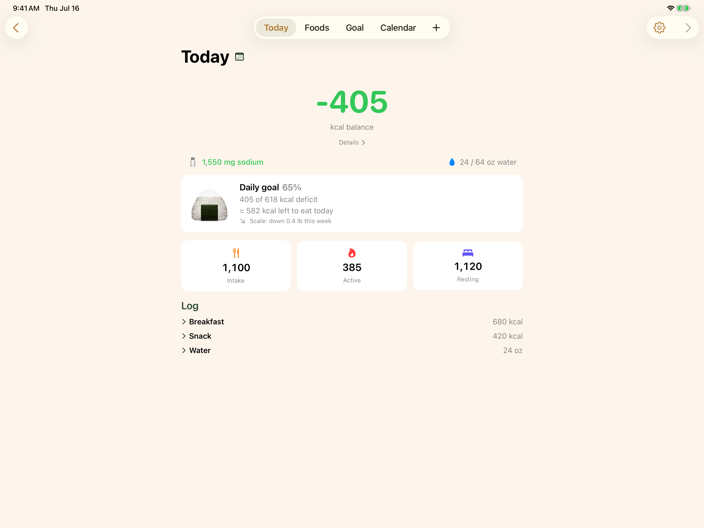
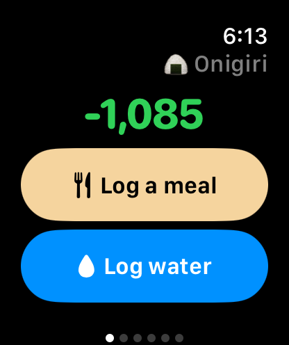
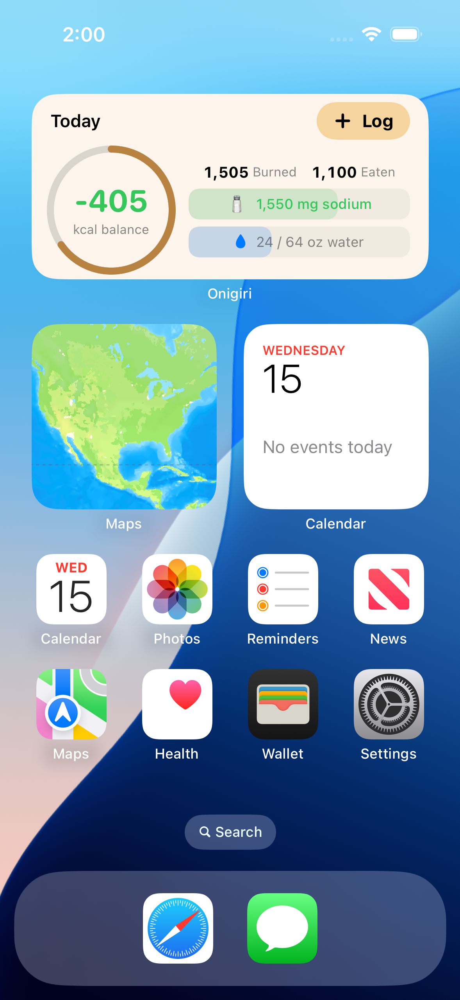

# Onigiri 🍙

A personal calorie, nutrition, and water tracker for iPhone, iPad, and Apple Watch. Everything you log is saved to Apple Health, right alongside the rest of your health data, so there's no account to sign up for and nothing to lose if you ever move on to another app.

It runs on iPhone, iPad, and Apple Watch, back to the iPhone XS and Apple Watch Series 4 (iOS 18 / watchOS 10 or newer).

**Built 100% agentically with [Claude Code](https://claude.com/claude-code).**

<p align="center">
  
</p>

## Features

- **Calorie & nutrition tracking** — your day at a glance: what you ate minus what you burned (Apple Health active + resting energy), with the calories you have left for the day.
- **Weight goal** — set a target weight and date. Onigiri works out the daily calorie budget to get there and projects your finish date from your real weight trend (smart scale → Apple Health).
- **Barcode & label scanning** — scan a product barcode or snap a photo of the nutrition-facts label, and calories and nutrients fill themselves in.
- **Fast logging** — log foods and water in a tap or two. Every entry is editable, with swipe to edit or delete and one-tap undo.
- **Custom meals** — bundle the foods you eat together into a meal, then log the whole thing in one tap.
- **Water tracking** — set your serving size and daily goal; log from the app, a widget, the watch, or a long-press on the add button.
- **Apple Watch app** — log on the go from a Favorites-then-Recent list, check your balance at a glance, and add balance and water complications to your watch face.
- **Widgets** — a Today widget (small, medium, large) with your calorie ring and a one-tap Log button, plus a month-stats card, water and streak widgets, and a Control Center water button.
- **Light & dark mode** — the app and its widgets follow your system appearance (screenshots below are light mode).

## Screenshots

| Foods | Goal | Calendar |
|---|---|---|
|  |  |  |

### iPad

<p align="center">
  
</p>

### Apple Watch

<p align="center">
  
</p>

### Home Screen widget

<p align="center">
  
</p>

## How the daily goal works

Onigiri reads your weight, what you eat, and what you burn from Apple Health, then does the math for you.

1. **Set a goal** — a target weight and date. Onigiri works out the **daily calorie deficit** you need to get there (burning more than you eat).
2. **Eat within your budget** — your budget is your average daily burn minus that deficit. As you log food, the Today ring shows **how much you can still eat today** and stay on pace.
3. **Lose weight** — finish each day at or under your budget and you hit the deficit; do it consistently and the scale follows.

**Example.** Your average burn is ~2,800 kcal/day and your goal needs a **350 kcal/day** deficit, leaving a **2,450 kcal budget**. You've eaten 2,300 so far, so the ring reads **150 kcal left** — room for 150 more and you'll still land on your target deficit by bedtime.

- **`kcal left` ≥ 0** → on track (still losing at your target pace).
- **Over budget** → you'll fall short of the pace for your target date (you may still lose, just slower).
- Eat nothing more and the deficit only grows — you'd *stop* losing only if you ate all the way up to your full burn (~2,800).

The **Daily goal** card shows the same thing from the deficit side: "245 of 350 kcal deficit" is what you've banked *so far* — the rest of the day's burn is still coming, which is why "245 banked" and "150 left to eat" both point at the same 350 target.

## Architecture at a glance

- **SwiftUI** apps for iOS and watchOS; shared `OnigiriKit` Swift package for models and logic
- **HealthKit is the log store**: every food/water log is written as Health samples (dietary energy, sodium, water). Weight and energy burn are read from Health. This gives free iPhone↔Watch log sync, visibility in the Health app, and zero lock-in.
- **SwiftData** stores only the library: foods, meals, goals, settings. Synced to the watch via WatchConnectivity.
- **XcodeGen** (`project.yml`) generates the Xcode project — no `.xcodeproj` merge conflicts.

See [docs/PLAN.md](docs/PLAN.md) for the full design and roadmap.

## Development setup

1. Xcode 26 (Mac App Store), then:
   ```sh
   sudo xcode-select -s /Applications/Xcode.app
   sudo xcodebuild -license accept
   xcodebuild -downloadPlatform iOS -downloadPlatform watchOS
   ```
2. `brew install xcodegen`
3. `cp local.yml.example local.yml` (set your team ID there for device builds; the empty default builds for the simulator)
4. `xcodegen generate` in the repo root, open `Onigiri.xcodeproj`
5. Xcode → Settings → Accounts → add your Apple ID (free personal team is fine)
6. On iPhone and Watch: Settings → Privacy & Security → Developer Mode → on
7. For `scripts/deploy-phone.sh`: `cp scripts/local-devices.env.example scripts/local-devices.env` and fill in your device name and watch IDs

**Free personal team note:** apps expire after 7 days — re-deploy weekly (⌘R with your phone connected, or `scripts/deploy-phone.sh`).

## License

MIT — see [LICENSE](LICENSE).
