# Onigiri 🍙

A personal calorie, sodium, and water tracker for iPhone + Apple Watch, built with SwiftUI and deeply integrated with Apple Health.

**Goal:** support losing 20 lb by making daily energy balance (calories in − calories out) effortless to see and log.

## Screenshots

| Today | Nutrition detail | Log sheet | Portion |
|---|---|---|---|
| 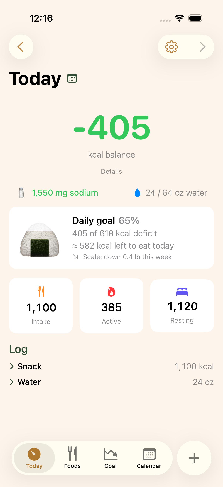 | 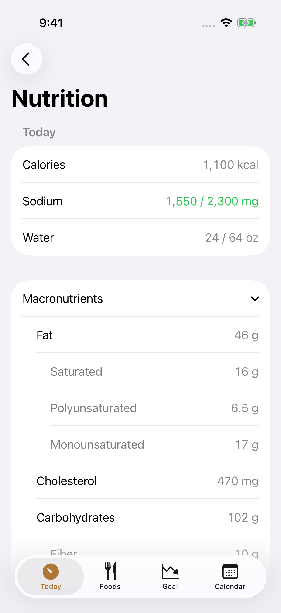 | 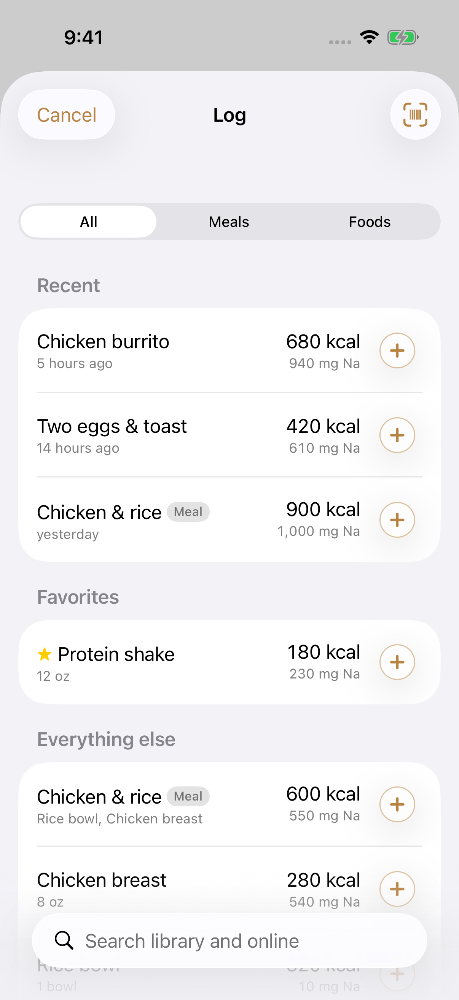 | 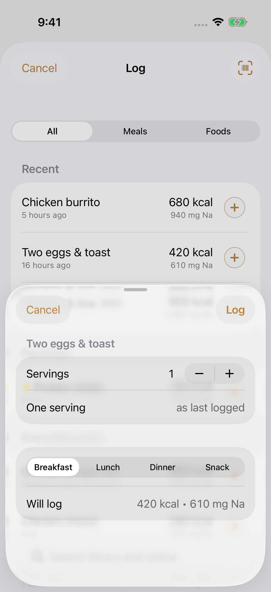 |

| Calendar | Month detail | Goal | Foods |
|---|---|---|---|
| 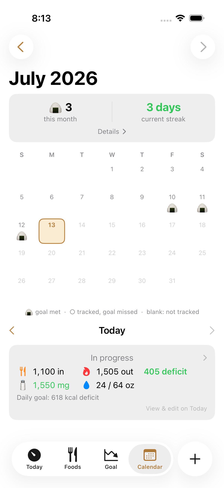 | 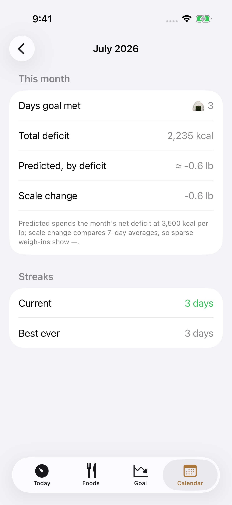 | 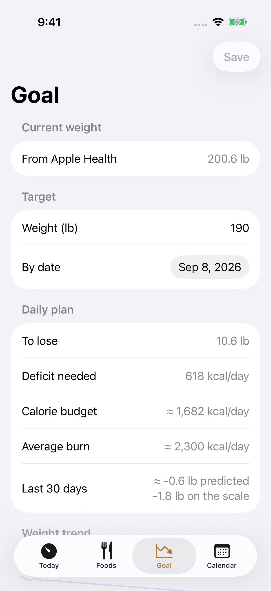 | 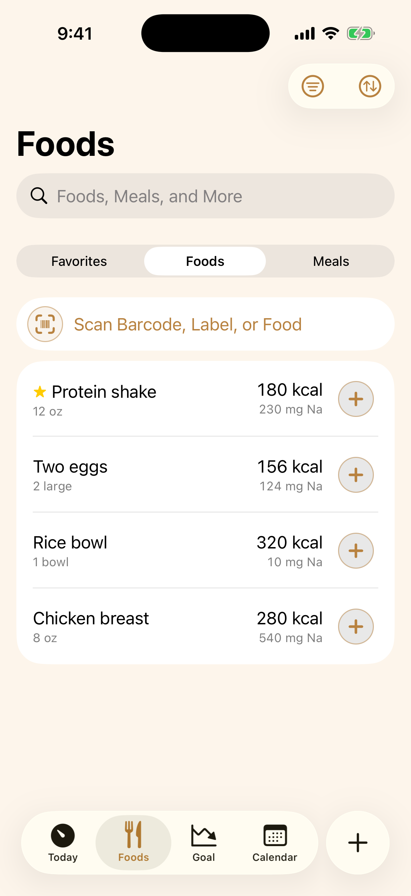 |

| Dark: Today | Dark: Nutrition | Dark: Calendar | Dark: Settings |
|---|---|---|---|
| 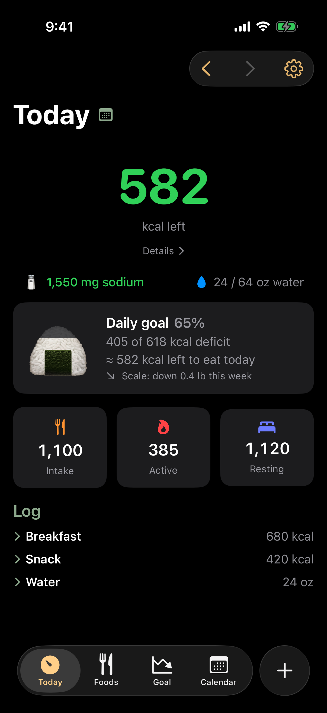 | 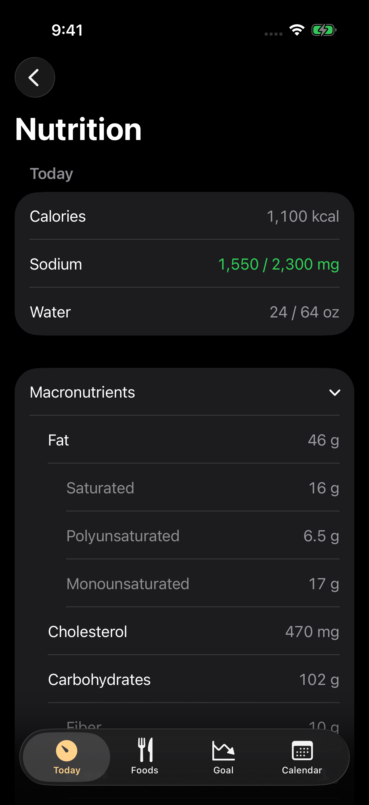 | 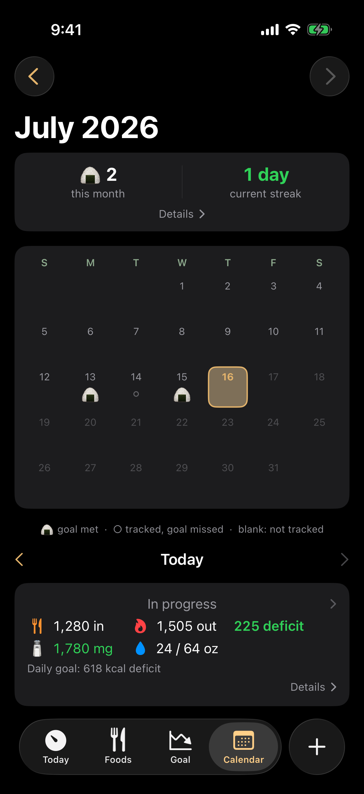 | 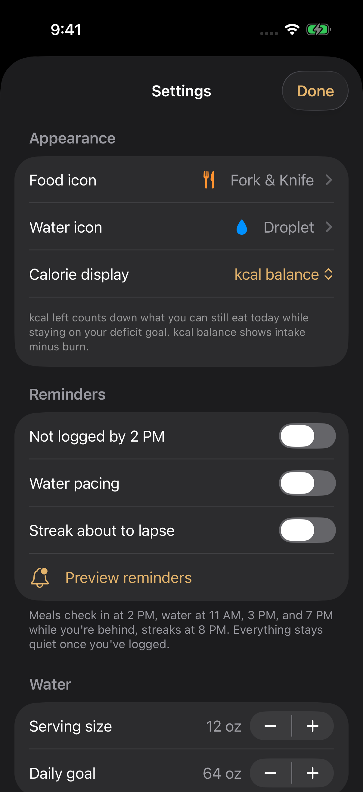 |

## Features

- **Daily calorie meter** — front and center: `Intake − (Active + Resting energy)` from Apple Health, plus remaining budget for the day
- **Weight goal tracking** — set a target weight and date; the app computes the daily deficit budget and projects your finish date from your actual weight trend (smart scale → Apple Health)
- **Food library** — save foods with calories + sodium (manual entry or barcode scan via OpenFoodFacts)
- **Meals** — bundle saved foods into one-tap recurring meals
- **Water tracking** — configurable serving size (e.g., 12 oz) and daily goal
- **Apple Watch app** — glanceable meter, one-tap water and meal logging, watch-face complications (balance + water)
- **Home-screen widgets** — small onigiri gauge, and a medium meter with instant add-water and a configurable one-tap meal button (no app launch)

## Architecture at a glance

- **SwiftUI** apps for iOS and watchOS; shared `OnigiriKit` Swift package for models and logic
- **HealthKit is the log store**: every food/water log is written as Health samples (dietary energy, sodium, water). Weight and energy burn are read from Health. This gives free iPhone↔Watch log sync, visibility in the Health app, and zero lock-in.
- **SwiftData** stores only the library: foods, meals, goals, settings. Synced to the watch via WatchConnectivity.
- **XcodeGen** (`project.yml`) generates the Xcode project — no `.xcodeproj` merge conflicts.

See [docs/PLAN.md](docs/PLAN.md) for the full design and roadmap.

## Development setup

1. Xcode 26 (Mac App Store), then:
   ```sh
   sudo xcode-select -s /Applications/Xcode.app
   sudo xcodebuild -license accept
   xcodebuild -downloadPlatform iOS -downloadPlatform watchOS
   ```
2. `brew install xcodegen`
3. `cp local.yml.example local.yml` (set your team ID there for device builds; the empty default builds for the simulator)
4. `xcodegen generate` in the repo root, open `Onigiri.xcodeproj`
5. Xcode → Settings → Accounts → add your Apple ID (free personal team is fine)
6. On iPhone and Watch: Settings → Privacy & Security → Developer Mode → on
7. For `scripts/deploy-phone.sh`: `cp scripts/local-devices.env.example scripts/local-devices.env` and fill in your device name and watch IDs

**Free personal team note:** apps expire after 7 days — re-deploy weekly (⌘R with your phone connected, or `scripts/deploy-phone.sh`).

## License

MIT — see [LICENSE](LICENSE).
